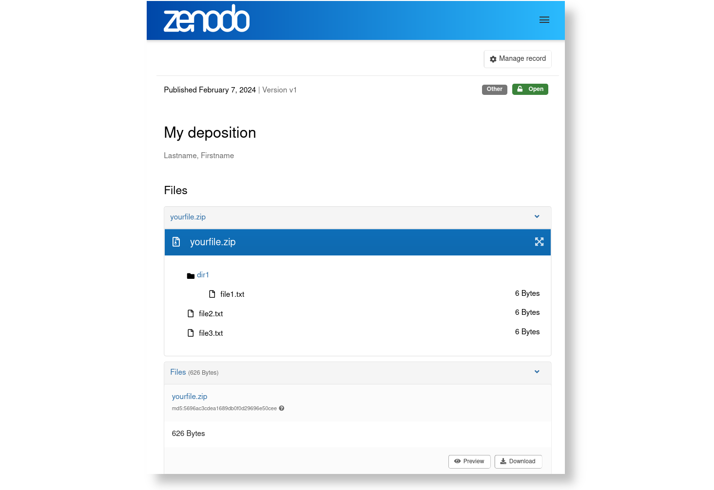

<p align="center">

</p> 
<p align="center">
    <a href="https://github.com/zenodraft/zenodraft"></a>
    <a href="https://github.com/zenodraft/zenodraft"></a>
    <a href="https://www.npmjs.com/package/zenodraft"></a>
    <a href="https://doi.org/10.5281/zenodo.5046392"></a>
    <a href="https://sonarcloud.io/dashboard?id=zenodraft_zenodraft"></a>
    <a href="https://sonarcloud.io/dashboard?id=zenodraft_zenodraft"></a>
    <a href="https://fair-software.eu"></a>
</p>
<p align="center">
You are welcome to leave feedback at https://github.com/zenodraft/zenodraft/issues.
</p>
<br>
<br>
    
## CLI to manage depositions on Zenodo

### Features

Use the command line to

1. create depositions on Zenodo
1. add files to depositions on Zenodo
1. update metadata to depositions on Zenodo
1. finalize/publish depositions on Zenodo

Everything also works on Zenodo Sandbox via the `--sandbox` flag. You'll need access tokens for either platform (see below).

### Usage example

```shell
# make sure you have the access token available as the
# environment variable ZENODO_ACCESS_TOKEN

# create a new, draft version in a new concept:
zenodraft deposition create concept
123456

# upload a local file, e.g. yourfile.zip
zenodraft file add 123456 yourfile.zip

# create some metadata file in Zenodo metadata format, e.g.
echo -e '{
  "creators": [
    {
      "name": "Lastname, Firstname"
    }
  ],
  "title": "My deposition"
}' > .zenodo.json

# update the metadata of the draft version
zenodraft metadata update 123456 .zenodo.json

# inspect the draft version on https://zenodo.org/deposit

# if all looks good, finalize the version by publishing it
zenodraft deposition publish 123456
```

Here is the result when viewed on Zenodo:



<br>
<br>

### CLI overview

```shell
zenodraft deposition create concept [--sandbox]
zenodraft deposition create version [--sandbox] <concept_id>
zenodraft deposition delete [--sandbox] <version_id>
zenodraft deposition publish [--sandbox] <version_id>
zenodraft deposition show details [--sandbox] <version_id>
zenodraft deposition show draft [--sandbox] <concept_id>
zenodraft deposition show files [--sandbox] <version_id>
zenodraft deposition show latest [--sandbox] <concept_id>
zenodraft deposition show prereserved [--sandbox] <version_id>
zenodraft file add [--sandbox] <version_id> <local filename>
zenodraft file delete [--sandbox] <version_id> <remote filename>
zenodraft metadata clear [--sandbox] <version_id>
zenodraft metadata update [--sandbox] <version_id> <local filename>
```

Additionally, use `--version` to show zenodraft's version and use `--help` to show the help on any command.

For a complete overview of the command line interface, see [here](README.cli-usage.md).

### Access tokens

To use `zenodraft`, a personal access token is required, one for each platform you plan on using.
`zenodraft` looks for the access token first in the environment variables named
`ZENODO_SANDBOX_ACCESS_TOKEN` and `ZENODO_ACCESS_TOKEN`, then in a file called
`.env`, which must reside in the directory from which you run `zenodraft`.
See <https://npmjs.com/package/dotenv> for details on how to format your `.env`
file correctly.

You can get your access tokens at

- https://sandbox.zenodo.org/account/settings/applications/ (Zenodo Sandbox; for testing and development)
- https://zenodo.org/account/settings/applications/ (Zenodo; for production)

### Prerequisites:

- node v14 (other versions may work)
- npm v7 (other versions may work)

### System install (recommended)

Install system-wide with the `-g` flag:

```shell
# global install
npm install -g zenodraft

# this next command should now point to the program location
which zenodraft

# use the zenodraft cli like so
zenodraft --version
zenodraft --help
# etc
```

### Project directory install

Install locally without `-g` flag and use `zenodraft` CLI via the
[`npx`](https://nodejs.dev/learn/the-npx-nodejs-package-runner) command. Note that this will create a `node_modules/`
directory, and that autocomplete only works when `zenodraft` is installed globally:

```shell
# local install
npm install zenodraft

# this next command returns empty for local installs
which zenodraft

# but you can still use the cli via npx
npx zenodraft --version
npx zenodraft --help
# etc
```

### No-install

[`npx`](https://nodejs.dev/learn/the-npx-nodejs-package-runner) allows for running executables without the need for
installation. Note that this will download and cache `zenodraft` from [npmjs.com](https://npmjs.com) if you don't already have it.

```shell
npx zenodraft --version
npx zenodraft --help
npx zenodraft deposition create concept --sandbox
# etc
```

### Docker 

Building the docker container:

```shell
docker build -t zenodraft https://raw.githubusercontent.com/zenodraft/zenodraft/0.13.0/Dockerfile
```

Running the docker container:

```shell
docker run --rm zenodraft --help
docker run --rm zenodraft --version
docker run --rm                   \
   -e ZENODO_SANDBOX_ACCESS_TOKEN \
   zenodraft deposition show details --sandbox 123456
docker run --rm                   \
   -e ZENODO_SANDBOX_ACCESS_TOKEN \
   -v ${PWD}:/data                \
   zenodraft metadata update --sandbox 123456 .zenodo.json

# etc
```

### Autocomplete

An autocomplete script is bundled with the package as `assets/autocomplete.sh`. You can print it to the terminal as follows:

```
zenodraft-autocomplete
```

Which will print something like:

```shell
#/usr/bin/env bash
_zenodraft_completions()
{
    ...
}
complete -F _zenodraft_completions zenodraft
```

Source this script to add autocomplete powers to the `zenodraft` program, for example using:
```
# Add autocomplete powers to zenodraft: 
TMPFILE=$(mktemp)
zenodraft-autocomplete > $TMPFILE
source $TMPFILE
```
You can make the change permanent by copying those 4 lines to the bottom of your `~/.bashrc`.
